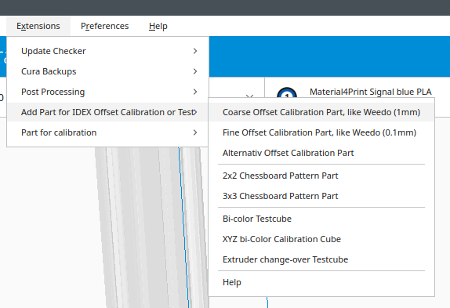
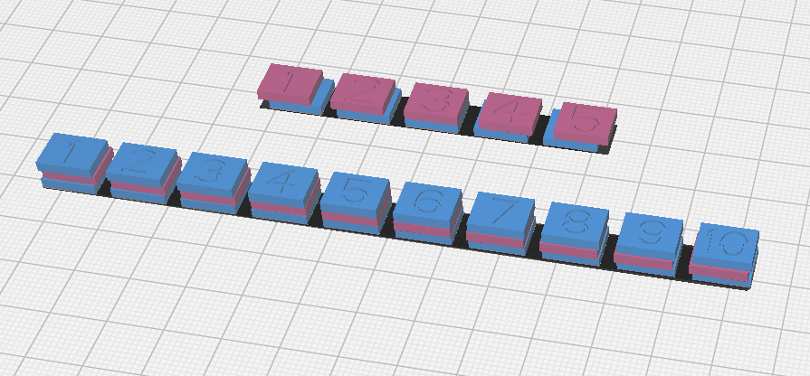
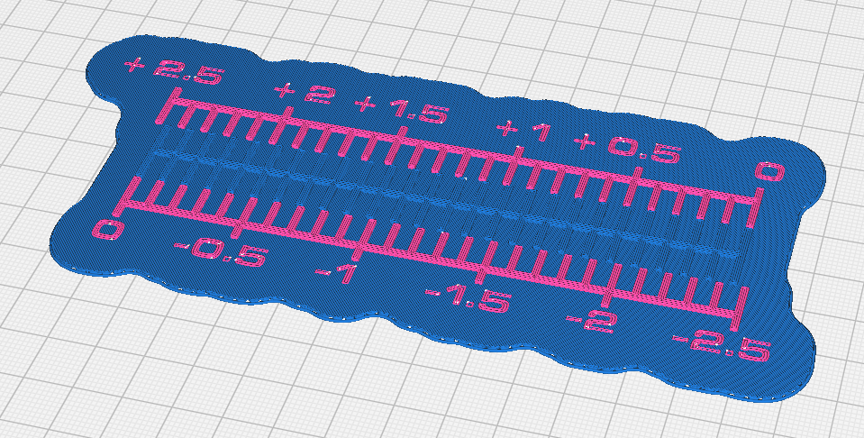
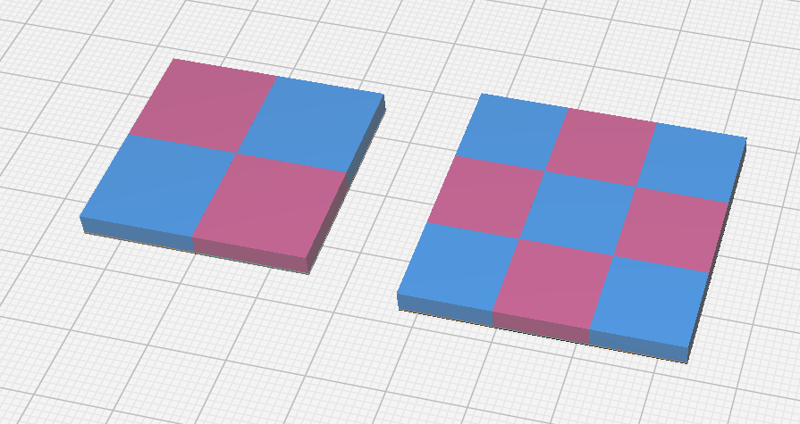
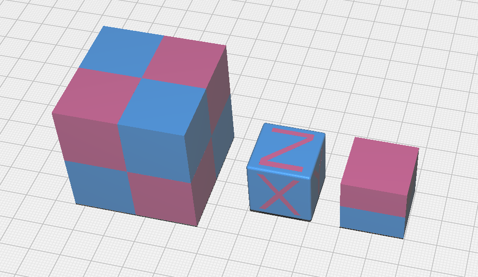

# IDEX Calibration Parts Plugin for Ultimaker Cura

This plugin adds a menu to add IDEX offset calibration and test parts. After adding a parts select and merge all models.

## Install
In the plugin directory, create a subdirectory called IdexCalibrationParts. In this subdirectory create another subdirectory with the same name. Unpack the contents of the zip-file in this subdirectory and restart Cura.

## Weedo like XY-Offset Calibration Parts

Print this parts with a raft

## Alternativ X-Calibration Part

Print this part with a raft

## Chessboard XY-Calibration Parts from the X40-Community

Application see: http://www.x40-community.org/index.php/the-3d-printer/how-to-calibrate-the-weedo-x40-printer/2-uncategorised/25-set-the-xy-offset

## XY-Offset Testparts from the X40-Community

